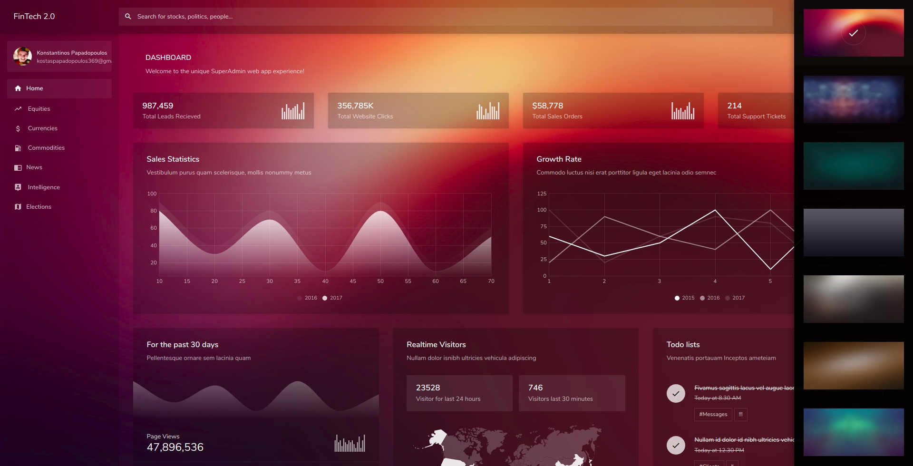

# FinTech-3.0

Financial Dashboard that provides charts and graphs related to financial instruments, like equities, currencies, commodities, as well as financial and political news. 

## Get started
In order to start Jarvis just clone the repository:
1. go to the dashboard directory `cd dashboard/`
2. run `python3 manage.py runserver`
3. visit localhost (usually port 8000)

## Contributing 
The project is at its very early stage.
Everyone is welcome to contribute either by pull requests or sending new ideas :)
